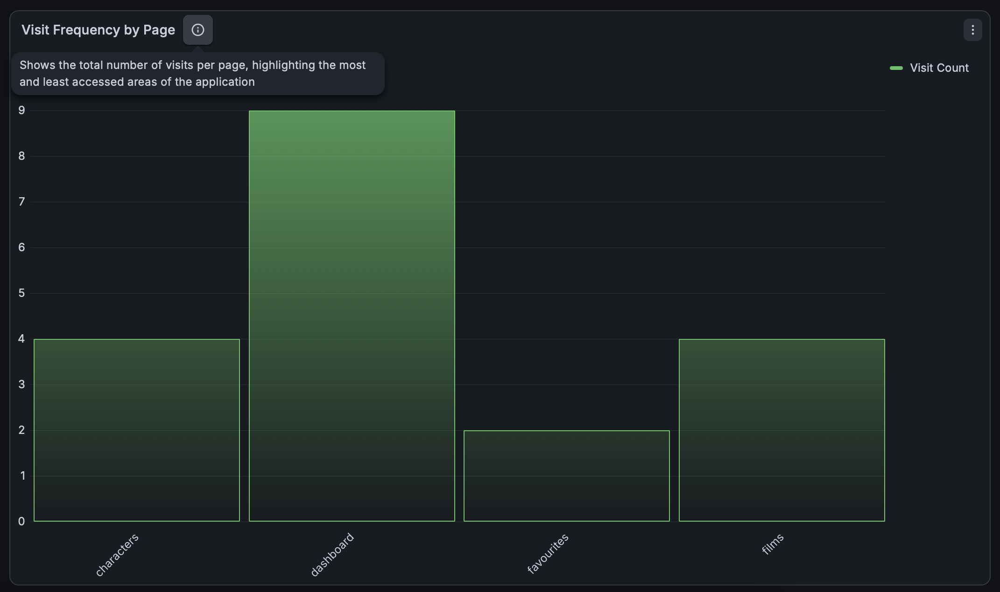

# Star Wars GUI

A React application built with Next.js and TypeScript that interacts with the [Star Wars API (SWAPI)](https://swapi.info/) to display information about Star Wars characters and films and allows users to mark their favourites.

---

## Getting Started

> **NOTE**: For the app to work correctly you need Node version **v22.17.0** and create a `.env` file in the root directory of the project. Check the end of README.md for more information about env variables.

- First install the node modules:
  `npm install`

- Run the development server:
  `npm run dev`

- To run build:
  `npm run build`

- To start the build:
  `npm start`

> **IMPORTANT**: You should always run the build before you do any pull requests. If any errors occur from the build, fix them before proceeding.

---

## Pages

| Page | URL | Description |
|---|---|---|
| Dashboard | `/dashboard` | Overview with stats cards for characters, films and favourites |
| Characters | `/characters` | Full list with search and pagination |
| Films | `/films` | Full list with search and pagination |
| Favourites | `/favourites` | All saved favourites persisted in localStorage |
| Detail | `/detail?type=character&id=1` | Detail view for a character or a film |
| 404 | Any invalid route | Custom not found page |

---

## Features

- Browse **82 characters** and **6 films** from the Star Wars
- **Search** characters by name and films by title with debounced API calls
- **Pagination** — 10 items per page
- **Favourite** any character or film — persisted across page refreshes via localStorage
- **Detail page** showing all properties for each resource
- **Welcome modal** on first visit — shown once, dismissed via localStorage
- **Custom 404 page** with Star Wars theme
- Responsive design across desktop and mobile

> **TIP**: To see the welcome modal again, run this in the browser console:
> ```js
> localStorage.removeItem("hasSeenWelcome")
> ```
> Or try a different browser or clear the cache.

---

## Tech Stack

| Concern | Choice |
|---|---|
| Framework | Next.js 15 (Pages Router) + TypeScript |
| Styling | Tailwind CSS |
| State Management | Zustand (with persist middleware) |
| Data Fetching | Native fetch via custom api-functions |
| Testing | Playwright |
| Package Manager | npm |
| API | [swapi.info](https://swapi.info/) |

---

## Testing

Testing is done with **Playwright** (e2e).

> **NOTE**: You need to have the app running before executing tests. Run `npm run build && npm start` first.

- To run through CLI:
  `npx playwright test`

- To use the GUI:
  `npx playwright test --ui`

- To look at the HTML report:
  `npx playwright show-report`

- To run codegen:
  `npx playwright codegen http://localhost:3000/dashboard`

When you run tests from CLI or GUI, a test report is created in:
`project_root_directory/playwright-report/index.html`

### Test Coverage

| File | What is tested |
|---|---|
| `dashboard.test.ts` | Navbar, navigation, hero section, stats cards, footer |
| `characters.test.ts` | Page load, search, empty state, pagination, favourites, navigation |
| `films.test.ts` | Page load, search, empty state, episode badge, favourites, navigation |
| `favourites.test.ts` | Page load, empty state, add/remove favourites |
| `detail.test.ts` | Character detail, film detail, back button, favourite toggle, 404 |

---

## Known Issues & Solutions Encountered

### SWAPI SSL Certificate
`swapi.dev` had an expired SSL certificate (`ERR_CERT_DATE_INVALID`). Switched to `swapi.info` which is actively maintained.

### swapi.info Response Format
Unlike `swapi.dev`, `swapi.info` returns a **flat array** instead of a paginated response `{count, results, next}`. Pagination logic was built client-side — fetch all, slice per page.

### Playwright on macOS 13
WebKit is not supported on macOS 13. Removed from `playwright.config.ts` — tests run on Chromium and Firefox only.

---

## Design Decisions

- **Accent color**: Sith Red (`red-500`) — chosen for its Star Wars villain aesthetic
- **Background images**: Different image per page for visual variety
- **Stats cards**: Two variants built (banner with background image + minimal row) — row selected as final
- **Logo**: Lightsaber icon (`lightsaber.png`) — inverted to white for dark backgrounds
- **Color research**: [tailwindcolor.tools](https://tailwindcolor.tools/hex-to-tailwind)

---

## Assets & Credits

- **Background & character images**: [Unsplash](https://unsplash.com/) — free to use
- **Welcome modal image**: Created in Figma using the Up Hellas company logo
- **Lightsaber favicon & logo**: [Flaticon](https://www.flaticon.com/free-icon/light-saber_922860)
- **Star Wars data**: [swapi.info](https://swapi.info/)

---

## AI Assistance

Parts of this project were built with the assistance of **Claude (Sonnet 4.6)** by Anthropic:

- `package.json` and config files (Next.js, Tailwind, TypeScript, PostCSS, ESLint)
- `src/types/types.ts` — TypeScript types
- `src/utils/` — `common-variables.ts`, `api-functions.ts`, `common-functions.ts`
- `src/store/` — 3 Zustand stores (favourites, characters, films)

The AI was used to discuss some of the initial project setup and improve design by describing existing components and desired outcomes. The overall project structure and coding conventions were inspired by and follow the same patterns used in previous similar projects I have worked on.

---

## EXTRA: User Engagement Tracking
This project includes basic user engagement tracking using a lightweight custom implementation
### How it works
- Each page fires a `trackEvent("page_visited", { page: "..." })` call on mount
- The `_app.tsx` tracks `page_transition` events on every route change
- Events are built as OpenTelemetry-shaped payloads and sent to a Next.js API route (`/api/track`)
- The API route forwards them to **Grafana Loki** — a log aggregation system used for monitoring and visualization
- No OTel SDK is used on the client — just a lightweight custom implementation
### What is tracked
| Event | Description |
|---|---|
| `page_visited` | Fired when a user visits a page |
| `page_transition` | Fired when a user navigates between pages |
### Grafana Visualization
Page visits are visualized in **Grafana** using the following LogQL query:
```logql
sum by (page) (
  count_over_time(
    {service="star-wars-gui", event_type="page_visited"} | json [$__range]
  )
)
```

> **NOTE**: You need your own Grafana Loki credentials. Add them to your `.env` file — see the Environment Variables section at the bottom of this README.

---

## Environment Variables

Create a `.env` file in the root directory with the following:

```env
NEXT_PUBLIC_SWAPI_URL=https://swapi.info/api
NEXT_PUBLIC_PORT=3000

# Grafana Loki — for user engagement tracking
# Get your credentials from Grafana Cloud
LOKI_URL=your_loki_url_here
LOKI_AUTH=your_loki_auth_here
```
